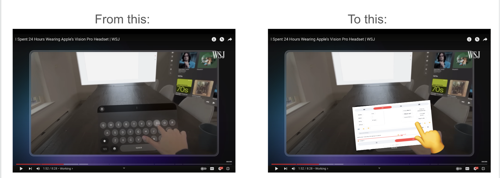

# 🚀 The Future of Typing

## Final Project Intelligent Interactive Systems (Winter 2023/24 Semester)

Submitted by:
- Idan Horowitz
- Jacob Link

## 📝 Description
We believe there is a new typing method which will emerge in the near future, due to the augmented reality tech being introduced to the word. 
When comming accross the Wall Street Journal's review of the Apple VisionPro,

They noted: "...one big problem." (see minute 1:49: https://youtu.be/8xI10SFgzQ8?si=WRSPMa4We3VgLh3Q&t=105) 

We decided to create a new concept keyborad for the AR world, solving this problem.

## 📦 Files Uploaded 

`algorithms.py`: handles prompting and processing of responses.

`api_keys.py`: holds the api keys (empty, modify manually).

`prompts.py`: final prompts used for Gemini.

`whisper_speech_to_text.py`: speech to text engine using Whisper.

**`typing_interface.py`: final streamlit app**

### mouse control interface:
|file name|mouse movement|mouse left click|features
|--|--|--|--
|`mouse_control_app_option_1.py`|nose|thumb-index click|--
|`mouse_control_with_fist_stop_mouse.py`|nose|thumb-index click|with left hand: open palm to start, close fist to stop the mouse moving
|`mouse_control_with_index.py`|right hand tip of index finger|left hand thumb-index click|--

📁 **images**: images used throughout the ReadMe file

## 🏃 How To Run
Follow these steps to get the application running: 
1. Clone the GitHub repository.
2. Manually insert the 2 api keys required into the `api_keys.py` file.
3. Install environment by using: `DECIDE HERE`
4. run `streamlit run typing_interface.py` from terminal.
5. repeat 1,2,3 in a new project (if using pycharm) or new workspace (if using vscode).
6. run `mouse_control_with_fist_stop_mouse.py`.
7. navigate to the window with the streamlit app running and start typing.
   
> 🔔 **Import Notes**:
> - Make sure you are connected to 1 display only! the app does not support multiple displays.
> 
> - running 2 seperate projects (streamlit app & mouse control) is essential to fully experience the final product. You can also assess the keyboard alone wihtout the mouse control app.

### Keyborad Result

## 📬 Contact

jacob.link@campus.technion.ac.il

idanhorowitz@campus.technion.ac.il

## 📃 License

Use wisely, might be adictive, beware.

----------

We hope you enjoyed the experience

❤️ 
